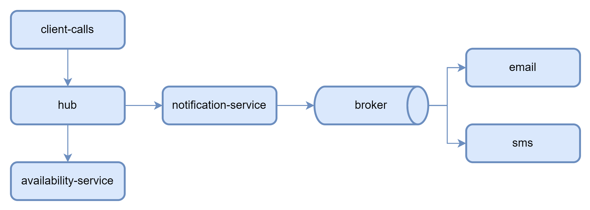

- [business platform demo](#business-platform-demo)
  - [architecture diagram](#architecture-diagram)
  - [Env vars](#env-vars)
  - [Build and push to dockerhub](#build-and-push-to-dockerhub)
  - [run the demo with docker](#run-the-demo-with-docker)
    - [Optionally create a dedicated network](#optionally-create-a-dedicated-network)
    - [Launch broker](#launch-broker)
    - [Launch apps](#launch-apps)
    - [Install and launch Grafana Alloy on Linux Host](#install-and-launch-grafana-alloy-on-linux-host)
  - [run demo on kubernetes](#run-demo-on-kubernetes)
    - [Generate a domain name and wildcard certificates with Letsencrypt](#generate-a-domain-name-and-wildcard-certificates-with-letsencrypt)
    - [Create ingress router](#create-ingress-router)
    - [Deploy OTEL Collector sending data to Grafana Cloud (option 1)](#deploy-otel-collector-sending-data-to-grafana-cloud-option-1)
    - [Deploy Grafana Alloy to send data to Grafana Cloud (option 2)](#deploy-grafana-alloy-to-send-data-to-grafana-cloud-option-2)
    - [start from scratch](#start-from-scratch)
    - [broker](#broker)
    - [availability-service](#availability-service)
    - [business-hub](#business-hub)
    - [notification-service](#notification-service)
    - [email](#email)
    - [sms](#sms)
    - [k6 load testing](#k6-load-testing)

# business platform demo

This is a guide to deploy a set of synchronous and asynchronous microservices in spring boot to observed with & Grafana LGTM OSS stack or Grafana Cloud.


## architecture diagram


## Env vars

```bash 
export MAIN_PROJECT_VERSION=$(mvn help:evaluate -Dexpression=project.version -q -DforceStdout)
export ACTIVEMQ_ARTEMIS_VERSION=2.33.0
export OTELCOL_VERSION=0.96.0
export K6_VERSION=0.50.0
export KUBE_INGRESS_ROOT_DOMAIN=gkube.duckdns.org


# grafana cloud key
export key=xxxx

#pusher to eu server
export MIMIR_HOST=https://prometheus-prod-24-prod-eu-west-2.grafana.net
export MIMIR_URL=${MIMIR_HOST}/api/prom/push
export MIMIR_USR=xxxx
export MIMIR_KEY=${key}

export LOKI_HOST=https://logs-prod-012.grafana.net
export LOKI_URL=${LOKI_HOST}/loki/api/v1/push
export LOKI_USR=xxxx
export LOKI_KEY=${key}

export TEMPO_URL=tempo-prod-10-prod-eu-west-2.grafana.net:443
export TEMPO_USR=xxxx
export TEMPO_KEY=${key}

# https://github.com/infinityofspace/certbot_dns_duckdns
export CERTBOT_DUCKDNS_VERSION=v1.3
export DUCKDNS_TOKEN=xxxx-xxxx-xxx-xxx-xxxxx
export EMAIL=xxx@yyy.com
export WILDCARD_DOMAIN=yourowndomain.duckdns.org

# https://github.com/kubernetes/ingress-nginx/blob/main/deploy/static/provider/baremetal/deploy.yaml
export NGINX_INGRESS_VERSION=1.10.1
export NGINX_INGRESS_KUBE_WEBHOOK_CERTGEN_VERSION=v1.4.1
```

## Build and push to dockerhub

```bash
mvn package
mvn exec:exec@buildpush -f business-hub/pom.xml
mvn exec:exec@buildpush -f availability-service/pom.xml
mvn exec:exec@buildpush -f message-consumer/pom.xml

```


## run the demo with docker

### Optionally create a dedicated network

```bash
docker network create --driver=bridge --subnet=172.19.0.0/16 --gateway=172.19.0.1 mainnet
```

### Launch broker

```bash
docker run --rm -d --net mainnet \
    -e ANONYMOUS_LOGIN=true \
    --name activemq-artemis -p 61616:61616 -p 8161:8161 apache/activemq-artemis:${ACTIVEMQ_ARTEMIS_VERSION}
  
docker stop activemq-artemis
```

### Launch apps

```bash
export PROJECT_VERSION=${MAIN_PROJECT_VERSION}

docker run --rm -d --net mainnet \
    -p 8080:8080 \
    -e OTEL_JAVAAGENT_ENABLED="true" \
    --name business-hub alainpham/business-hub:${PROJECT_VERSION}
    
docker run --rm -d --net mainnet \
    -e OTEL_JAVAAGENT_ENABLED="true" \
    --name availability-service alainpham/availability-service:${PROJECT_VERSION}
    
docker run --rm -d --net mainnet \
    -e OTEL_JAVAAGENT_ENABLED="true" \
    --name notification-service alainpham/notification-service:${PROJECT_VERSION}

docker run --rm -d --net mainnet \
    -e OTEL_JAVAAGENT_ENABLED="true" \
    -e APP_QUEUE="email" \
    -e OTEL_RESOURCE_ATTRIBUTES=service.name=email,service.namespace=email-ns,service.instance.id=email-cnt,service.version=${PROJECT_VERSION} \
    --name email alainpham/message-consumer:${PROJECT_VERSION}

docker run --rm -d --net mainnet \
    -e OTEL_JAVAAGENT_ENABLED="true" \
    -e APP_QUEUE="sms" \
    -e OTEL_RESOURCE_ATTRIBUTES=service.name=sms,service.namespace=sms-ns,service.instance.id=sms-cnt,service.version=${PROJECT_VERSION} \
    --name sms alainpham/message-consumer:${PROJECT_VERSION}
```

### Install and launch Grafana Alloy on Linux Host


```bash
ARCH="amd64" GCLOUD_HOSTED_METRICS_URL="${MIMIR_URL}" GCLOUD_HOSTED_METRICS_ID="{MIMIR_USR}" GCLOUD_SCRAPE_INTERVAL="60s" GCLOUD_HOSTED_LOGS_URL="${LOKI_URL}" GCLOUD_HOSTED_LOGS_ID="${LOKI_USR}" GCLOUD_RW_API_KEY="${key}" /bin/sh -c "$(curl -fsSL https://storage.googleapis.com/cloud-onboarding/alloy/scripts/install-linux.sh)"

```

## run demo on kubernetes

The kube deployment yaml files use ingress, to expose application http(s) services to ouside of kubernetes through a loadbalancer type service.

If you want to have clean certificates with valid letsencrypt and a proper domain name follow these optional steps. I use the free duckdns.org dns service.

For this demo to work you this section is optional

this is the architecture we will be building


### Generate a domain name and wildcard certificates with Letsencrypt

Go to duckdns.org and create a domain name as in yourowndomain.duckdns.org. You don't need to specify an IP address yet. We will point it to the 
All applications deployed on kube will be accessible with an url like appname.yourowndomain.duckdns.org

```bash
docker run -v "$(pwd)/sensitive/letsencrypt/data:/etc/letsencrypt" -v "$(pwd)/sensitive/letsencrypt/logs:/var/log/letsencrypt" infinityofspace/certbot_dns_duckdns:${CERTBOT_DUCKDNS_VERSION} \
   certonly \
     --non-interactive \
     --agree-tos \
     --email ${EMAIL} \
     --preferred-challenges dns \
     --authenticator dns-duckdns \
     --dns-duckdns-token ${DUCKDNS_TOKEN} \
     --dns-duckdns-propagation-seconds 15 \
     -d "*.${WILDCARD_DOMAIN}"

sudo chown -R ${USER}:${USER} $(pwd)/sensitive/letsencrypt/data
```

### Create ingress router

```bash
kubectl create ns ingress-nginx

kubectl -n ingress-nginx create  secret tls nginx-ingress-tls  --key="$(pwd)/sensitive/letsencrypt/data/live/$WILDCARD_DOMAIN/privkey.pem"   --cert="$(pwd)/sensitive/letsencrypt/data/live/$WILDCARD_DOMAIN/fullchain.pem"  --dry-run=client -o yaml | kubectl apply -f -

#ingress with LoadBalancer
wget -O /tmp/ingresslb.yaml https://raw.githubusercontent.com/alainpham/dev-environment/master/workstation-installation/templates/ingress-loadbalancer-notoleration.yaml
envsubst < /tmp/ingresslb.yaml | kubectl -n ingress-nginx apply -f -


# alternative ingress with hostport on non cloud instances
wget -O /tmp/ingress.yaml https://raw.githubusercontent.com/alainpham/dev-environment/master/workstation-installation/templates/ingress-hostport-notoleration.yaml
envsubst < /tmp/ingress.yaml | kubectl -n ingress-nginx apply -f -

```

### Deploy OTEL Collector sending data to Grafana Cloud (option 1)
```bash

export CONTAINER_REGISTRY=otel
export PROJECT_ARTIFACTID=opentelemetry-collector-contrib
export PROJECT_VERSION=${OTELCOL_VERSION}

kubectl create ns agents

wget -O /tmp/otelcol.yaml https://raw.githubusercontent.com/alainpham/business-platform-demo/master/otelcol/otelcol.yaml
envsubst < /tmp/otelcol.yaml | kubectl -n agents apply -f -
```

### Deploy Grafana Alloy to send data to Grafana Cloud (option 2)

```bash
helm repo add grafana https://grafana.github.io/helm-charts &&
  helm repo update &&
  helm upgrade --install --atomic --timeout 300s grafana-k8s-monitoring grafana/k8s-monitoring \
    --namespace "agents" --create-namespace --values - <<EOF
cluster:
  name: gkube
externalServices:
  prometheus:
    host: "${MIMIR_HOST}"
    basicAuth:
      username: "${MIMIR_USR}"
      password: "${MIMIR_KEY}"
  loki:
    host: "${LOKI_HOST}"
    basicAuth:
      username: "${LOKI_USR}"
      password: "${LOKI_KEY}"
  tempo:
    host: "${TEMPO_URL}"
    basicAuth:
      username: "${TEMPO_USR}"
      password: "${TEMPO_KEY}"
metrics:
  enabled: true
  cost:
    enabled: true
  node-exporter:
    enabled: true
logs:
  enabled: true
  pod_logs:
    enabled: true
  cluster_events:
    enabled: true
traces:
  enabled: true
receivers:
  grpc:
    enabled: true
  http:
    enabled: true
  zipkin:
    enabled: true
opencost:
  enabled: true
  opencost:
    exporter:
      defaultClusterId: gkube
    prometheus:
      external:
        url: "${MIMIR_HOST}/api/prom"
kube-state-metrics:
  enabled: true
prometheus-node-exporter:
  enabled: true
prometheus-operator-crds:
  enabled: true
alloy: {}
alloy-events: {}
alloy-logs: {}
EOF
```

### start from scratch

```
kubectl delete namespace business-platform
kubectl create ns business-platform

```

### broker

```bash
export CONTAINER_REGISTRY=apache
export PROJECT_ARTIFACTID=activemq-artemis
export PROJECT_VERSION=${ACTIVEMQ_ARTEMIS_VERSION}

kubectl create ns business-platform

wget -O /tmp/broker.yaml https://raw.githubusercontent.com/alainpham/business-platform-demo/master/broker/broker.envsubst.yaml
envsubst < /tmp/broker.yaml | kubectl apply -n business-platform -f -

envsubst < /tmp/broker.yaml | kubectl delete -n business-platform -f -
```

### availability-service

```bash
export PROJECT_ARTIFACTID=availability-service
export CONTAINER_REGISTRY=alainpham
export PROJECT_VERSION=${MAIN_PROJECT_VERSION}


wget -O /tmp/availability-service.yaml https://raw.githubusercontent.com/alainpham/business-platform-demo/master/availability-service/src/main/kube/deploy.envsubst.yaml
envsubst < /tmp/availability-service.yaml | kubectl apply -n business-platform -f -

envsubst < /tmp/availability-service.yaml | kubectl delete -n business-platform  -f -
```

### business-hub

```bash
export PROJECT_ARTIFACTID=business-hub
export CONTAINER_REGISTRY=alainpham
export PROJECT_VERSION=${MAIN_PROJECT_VERSION}

wget -O /tmp/business-hub.yaml https://raw.githubusercontent.com/alainpham/business-platform-demo/master/business-hub/src/main/kube/deploy.envsubst.yaml
envsubst < /tmp/business-hub.yaml | kubectl apply -n business-platform  -f -

envsubst < /tmp/business-hub.yaml | kubectl delete -n business-platform  -f -
```

### notification-service

```bash
export PROJECT_ARTIFACTID=notification-service
export CONTAINER_REGISTRY=alainpham
export PROJECT_VERSION=${MAIN_PROJECT_VERSION}

wget -O /tmp/notification-service.yaml https://raw.githubusercontent.com/alainpham/business-platform-demo/master/notification-service/src/main/kube/deploy.envsubst.yaml
envsubst < /tmp/notification-service.yaml | kubectl apply -n business-platform  -f -

envsubst < /tmp/notification-service.yaml | kubectl delete -n business-platform  -f -
```

### email

```bash
export PROJECT_ARTIFACTID=message-consumer
export APPLICATION_NAME=email
export CONTAINER_REGISTRY=alainpham
export PROJECT_VERSION=${MAIN_PROJECT_VERSION}

wget -O /tmp/message-consumer.yaml https://raw.githubusercontent.com/alainpham/business-platform-demo/master/message-consumer/src/main/kube/deploy.envsubst.yaml
envsubst < /tmp/message-consumer.yaml | kubectl apply -n business-platform  -f -

envsubst < /tmp/message-consumer.yaml | kubectl delete -n business-platform  -f -
```

### sms

```bash
export PROJECT_ARTIFACTID=message-consumer
export APPLICATION_NAME=sms
export CONTAINER_REGISTRY=alainpham
export PROJECT_VERSION=${MAIN_PROJECT_VERSION}

wget -O /tmp/message-consumer.yaml https://raw.githubusercontent.com/alainpham/business-platform-demo/master/message-consumer/src/main/kube/deploy.envsubst.yaml
envsubst < /tmp/message-consumer.yaml | kubectl apply -n business-platform  -f -

envsubst < /tmp/message-consumer.yaml | kubectl delete -n business-platform  -f -
```

### k6 load testing

```bash
export CONTAINER_REGISTRY=grafana
export PROJECT_ARTIFACTID=k6
export PROJECT_VERSION=${K6_VERSION}
export BASE_URL=https://business-hub.${KUBE_INGRESS_ROOT_DOMAIN}

wget -O /tmp/k6.yaml https://raw.githubusercontent.com/alainpham/business-platform-demo/master/k6/k6.yaml
envsubst < /tmp/k6.yaml | kubectl apply -n business-platform  -f -

envsubst < /tmp/k6.yaml | kubectl delete -n business-platform  -f -
```